#1. MsgCenter功能概述
##1.1 系统背景  
>- 随着智能运维平台aisee的快速发展及各个业务的展开，系统及模块越来越多，各个系统间相互通信及消息传递都各自维护一个restful接口功能模块，导致调用关系错综复杂、难以维护，并且系统间消息传递效率低下，急需设计统一消息中心对这类业务进行支撑。  
>- 为了将各个应用系统之间进行业务解耦、消息汇集、通知推送及对业务的透明化处理、各应用通知消息统一管理和处理。  
>- 同时也为了方便对各应用的整体把控，保证系统的稳定性，也方便各应用需要使用消息中间件时的快速搭建，因此搭建消息中心，提供整体的解决方案。  
>- 相对于传统应用间直接调用或定时任务查询数据库获取数据的方式，使用消息中心让各应用轻易感知其他应用的变动，采用主动推送、及时获取数据变化的方式进行。  
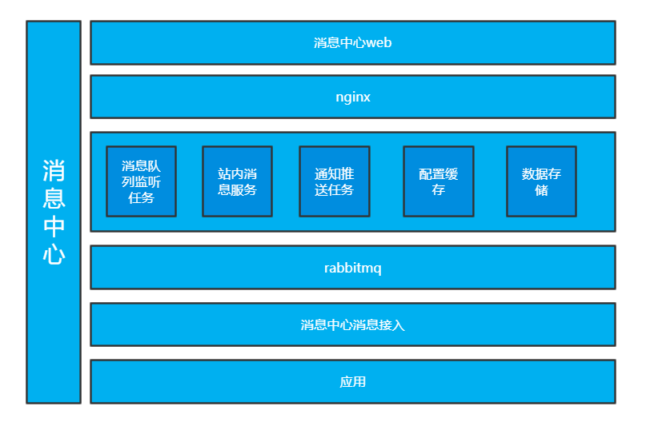

应用在消息中心web注册应用之后，可以将应用消息通过消息中心客户端消息接入模块推送到消息中心。消息中心消息队列监听任务从rabbitmq获取应用消息进行处理，站内消息服务提供站内私信消息、群消息、系统消息通知服务，通知推送任务将应用告警消息通过微信、邮件、短信等方式通知相关用户，配置缓存提供应用、用户、策略缓存服务。

***

##1.2 服务架构
>- 消息中心收集各个系统的应用消息，各个系统通过在消息中心注册，通过消息中的客户端SDK发送消息到消息中心，消息中心接收并处理这些消息。
>- 用户可以订阅消息中心的消息，订阅之后可以配置消息的推送通知策略，通过邮件、微信、短信等方式实时通知用户。
>- 消息中心除了消息收集、消息推送，同时也是一个完整的稳定的消息闭环，是一个完备的消息体系，支持各种业务，监控，统计，分析，任务、告警等数据的接入，为上游系统提供便利的接入能力及消息推送能力。
>- 消息中心也提供完整站内消息通信服务，基于netty 作为网络层框架，构建海量推送模型，使用静默长连接通道，实现从消息接收、推送、确认，整个过程的完全异步化处理。  
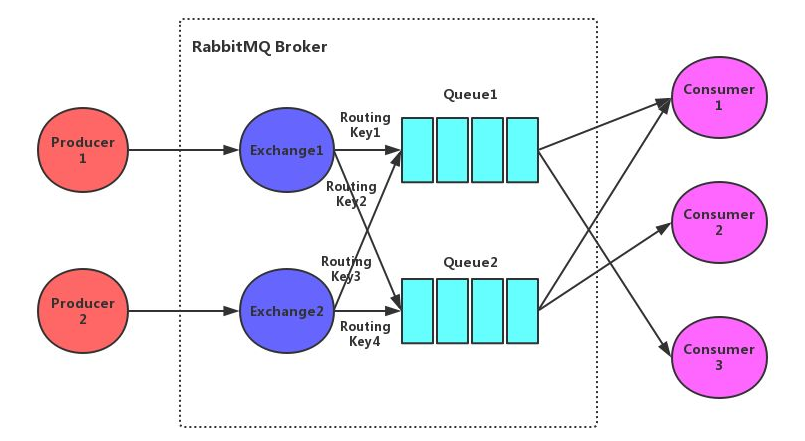

***

##1.3 功能简述  
消息中心主要包括消息中心客户端SDK、消息中心服务端应用。客户端SDK以jar包形式提供给应用使用，提供发送消息和同步消息中心应用配置功能。服务端包括应用配置、用户及通知配置、消息处理、站内私信、通知推送几大模块，各模块包含功能如下：
>- 应用配置管理模块：该模块主要包含配置应用、配置应用模块、及相应队列、交换、绑定的配置
>- 用户及通知配置模块：该模块配置应用及模块对应消息归属，即应用发送到消息中心的消息是归属于哪个用户（或多个），以及配置告警消息如何推送给用户
>- 消息处理模块：该模块处理消息中心接收到的消息
>- 站内私信模块：该模块提供站内用户对用户消息、用户对群组消息、以及系统消息通信模式 
>- 通知推送模块：该模将消息通知任务通过邮件、微信、短信等方式推送给相应的用户，并且提供通知压缩、日志记录功能
>- 消息中心客户端SDK模块：以jar包形式提供给应用使用，应用配置后可以向消息中心发送消息及动态监控在消息中心配置的应用及模块信息。
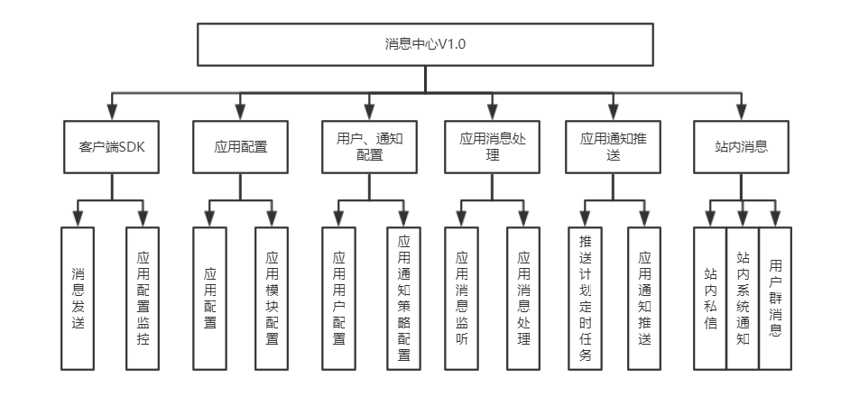

***

#2. 消息中心帮助手册
##2.1 仪表盘
展示个人配置的仪表盘数据。
###2.1.1  仪表盘预览
显示仪表盘配置后展示的数据。
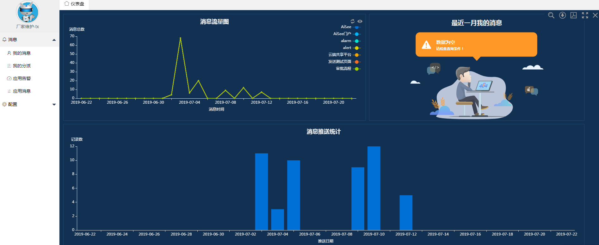

###2.1.2  仪表盘配置
在预览仪表盘页面右上角关闭预览页，就可以进入仪表盘配置页面。
具体的仪表盘配置规则，可以查看仪表盘的帮助文档。
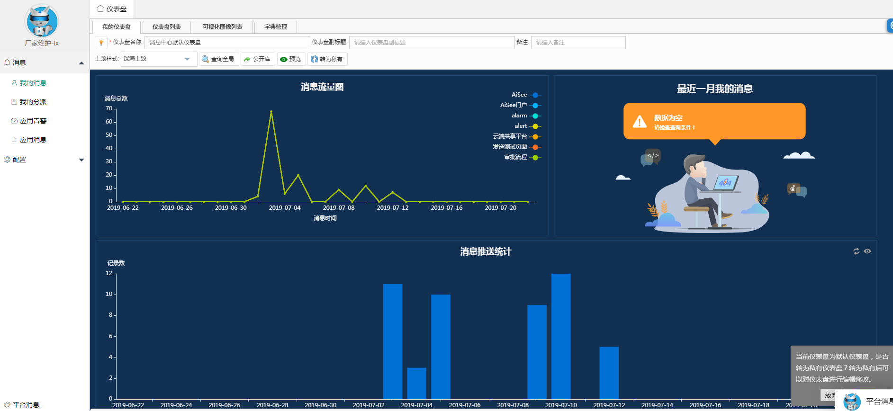

***

##2.2 平台消息
平台消息是平台用户之间发送和接受即时信息的组件，平台用户之间可以发送和结束即时信息。
点击页面左下角的平台消息，页面右下角弹出平台消息组件。
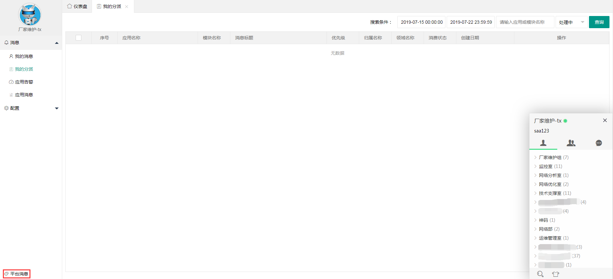
组件共有7个部分组成
>- 用户状态和签名
>- 联系人栏
>- 群组栏
>- 历史会话栏
>- 搜索和背景
>- 用户的新消息
>- 聊天窗口

###2.2.1 用户状态和签名

> **用户状态**
>>- 用户可以选择在线或者隐身
>>- 在线时，状态栏显示亮色
>>- 隐身时，状态栏显示灰色

> **签名**
>>- 用户可以自定义签名
>>- 签名会显示在联系人栏，联系人信息下

###2.2.2 联系人栏
> **联系人栏**  
> 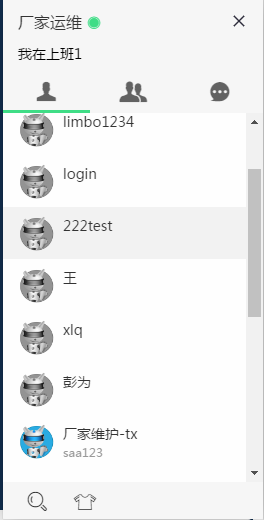
>>- 按群组显示所有的用户
>>- 没有群组的用户会划分到未分组的群组中
>>- 显示用户的状态和签名
>>- 点击用户，打开与该用户的聊天窗口

###2.2.3 群组栏
> **群组栏**  
> 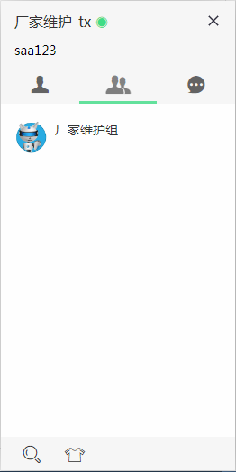
>>- 显示当前用户所在的群组
>>- 没有群组的用户会划分到未分组的群组中
>>- 点击群组，打开群组聊天窗口，可在群组内聊天

###2.2.4 历史会话栏
> **历史会话栏**  
> 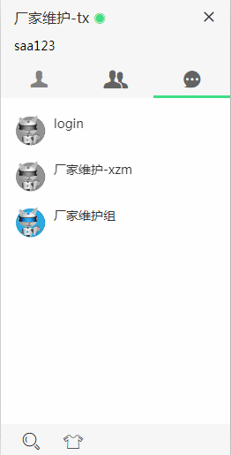
>>- 显示曾经打开过聊天窗口的用户和群组
>>- 点击用户，打开与该用户的聊天窗口
>>- 点击群组，打开群组聊天窗口，可在群组内聊天

###2.2.5 搜索和背景
> **搜索**  
> 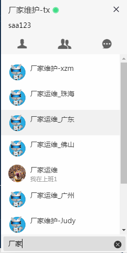
>>- 输入用户名称，可以模糊搜索用户和群组
>>- 点击用户，打开与该用户的聊天窗口
>>- 点击群组，打开群组聊天窗口，可在群组内聊天

> **背景**  
> 
>>- 用户可以选择背景
>>- 背景会在平台消息组件和聊天窗口中展示

###2.2.6 用户的新消息
> **用户的新消息**  
> 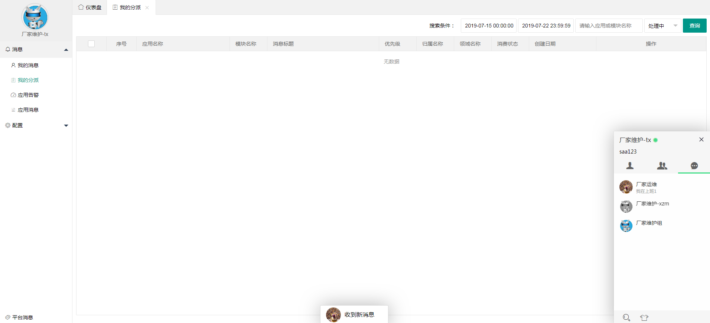
>>- 当收到新的用户的聊天消息或群组的聊天信息时，中间底部会有新消息的提示窗
>>- 点击提示窗，打开聊天窗口
>>- 多个新的消息会全部显示到聊天窗口

###2.2.7 聊天窗口
> **用户聊天窗口**  
> 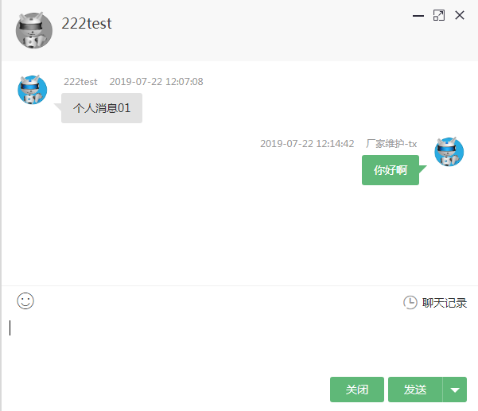
>>- 对方发的信息在左侧，自己发的信息在右侧
>>- 显示消息接收到消息的时间
>>- 新的消息在旧的消息下方

> **群组聊天窗口**  
> 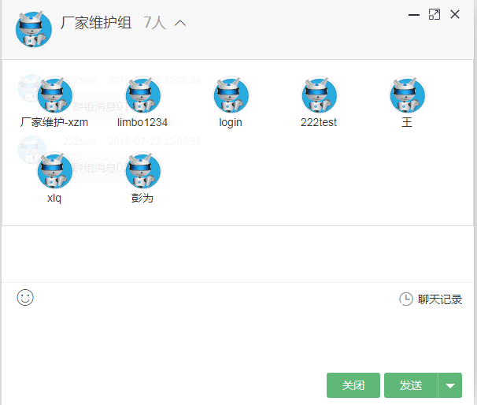
>>- 对方发的信息在左侧，自己发的信息在右侧
>>- 显示消息接收到消息的时间
>>- 新的消息在旧的消息下方
>>- 点击群组名称旁边的下拉箭头，显示除自己外的其他群组成员

> **多个聊天窗口**  
> 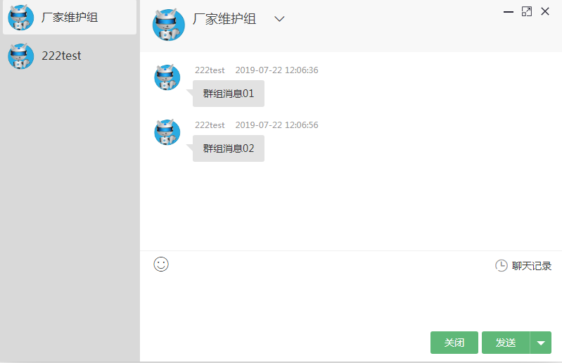
>>- 多个聊天窗口会全部显示到聊天窗口
>>- 点击用户或群组，可以切换聊天窗口

> **聊天记录**  
> 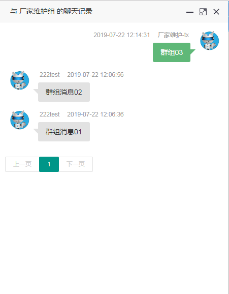
>>- 对方发的信息在左侧，自己发的信息在右侧
>>- 显示消息接收到消息的时间
>>- 新的消息在旧的消息上方
>>- 消息分页显示，最新的消息在第一页

***

##2.3 消息
###2.3.1 我的消息
**功能描述**
>1. 默认显示当前一周内处理中我的告警消息；
>2. 显示消息的各项信息(包括优先级以及处理状态)；
>3. 处理推送给自己或其他人转交给自己的消息；
>4. 可查看消息详情，对消息进行关闭和转交操作；
>5. 可根据搜索条件搜索我的历史消息(不包括转交的消息)。

主页面如下图所示：
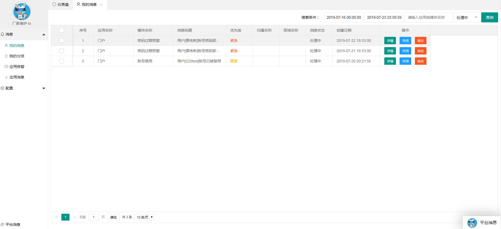
---
**我的消息列表：**
>- 默认显示当前一周内处理中我的告警消息，按创建日期倒序排列
>- 显示消息的来源，包括应用名称，模块名称，归属名称和领域名称
>- 显示消息的优先级和消息状态
>- 显示消息的创建时间
>- 归属名称和领域名称可以为空，其他项不能为空

**消息操作：**
>- 处理中的消息操作包括详情、关闭和转交三个操作
>- 已关闭的消息操作只有详情操作
>- 点击详情，弹窗显示消息的详细信息
>- 点击关闭，弹窗填写关闭告警信息的相关内容，可作为相似告警的推荐解决方案
>- 点击转交，弹窗选择用户转交告警信息，转交后该信息将不出现在我的消息列表，移动到我的分派列表

**查询：**
>- 根据搜索条件搜索我的历史消息(不包括转交的消息)
>- 可选择时间段搜索我的消息
>- 可输入应用或模块的名称搜索我的消息
>- 可选择消息状态搜索我的消息
>- 搜索后的列表按照消息状态和创建日期倒序排列，处理中的消息在前，已关闭的消息在后

**分页控件：**
>- 显示一共有多少条消息以及每页展示多少条消息
>- 显示一共有多少页消息以及当前所在的页
>- 可以点击页码进行翻页
>- 可以输入页码，点击确定进行翻页
>- 可以选择每页展示多少条消息

***

###2.3.2 我的分派
**功能描述**
>1. 默认显示当前一周内处理中我的分派消息；
>2. 显示消息的各项信息(包括优先级以及处理状态)；
>3. 查看转交给其他人的消息；
>4. 可点击消息详情，查看消息的历史详细信息；
>5. 可根据搜索条件搜索我的分派消息。

主页面如下图所示：
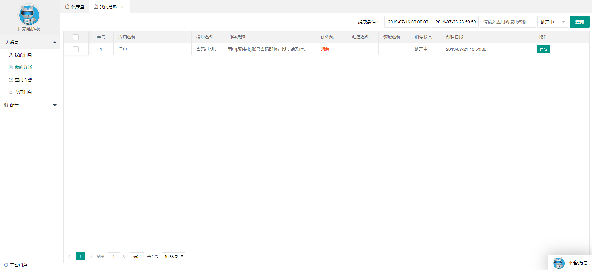
---
**我的分派列表：**
>- 默认显示当前一周内处理中我的分派告警，按创建日期倒序排列
>- 显示消息的来源，包括应用名称，模块名称，归属名称和领域名称
>- 显示消息的优先级和消息状态
>- 显示消息的创建时间
>- 归属名称和领域名称可以为空，其他项不能为空

**消息操作：**
>- 消息操作只有详情操作
>- 点击详情，弹窗显示消息的详细信息

**查询：**
>- 根据搜索条件搜索我的分派消息
>- 可选择时间段搜索我的分派消息
>- 可输入应用或模块的名称搜索我的分派消息
>- 可选择消息状态搜索我的分派消息
>- 搜索后的列表按照创建日期倒序排列

**分页控件：**
>- 显示一共有多少条消息以及每页展示多少条消息
>- 显示一共有多少页消息以及当前所在的页
>- 可以点击页码进行翻页
>- 可以输入页码，点击确定进行翻页
>- 可以选择每页展示多少条消息

***

###2.3.3 应用告警
**功能描述**
>1. 默认显示当前一周内未处理的应用告警消息；
>2. 显示消息的各项信息(包括优先级以及处理状态)；
>3. 应用产生的告警信息，没有配置用户配置，告警消息就会推送到这里；
>4. 可查看消息详情，对消息进行认领和分派操作；
>5. 可根据搜索条件搜索应用告警消息(不包括已认领和分派的消息)。

主页面如下图所示：
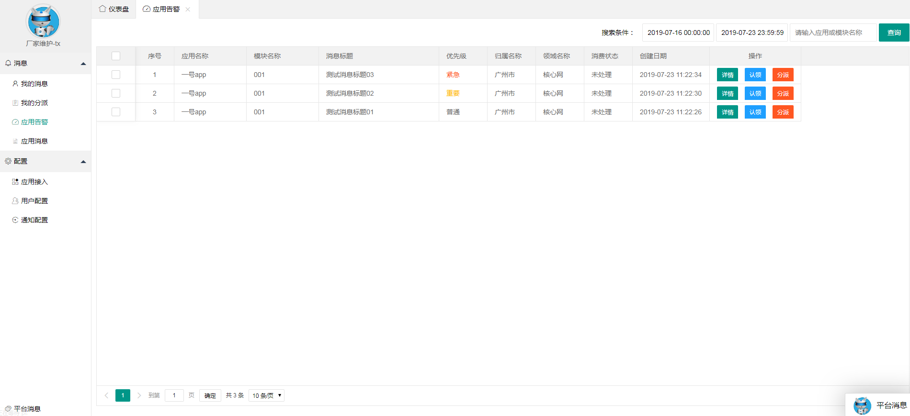
---
**应用告警列表：**
>- 默认显示当前一周内未处理的应用告警消息，按创建日期倒序排列
>- 显示消息的来源，包括应用名称，模块名称，归属名称和领域名称
>- 显示消息的优先级和消息状态(消息状态只能是未处理)
>- 显示消息的创建时间
>- 归属名称和领域名称可以为空，其他项不能为空

**消息操作：**
>- 未处理的消息操作包括详情、认领和分派三个操作
>- 点击详情，弹窗显示消息的详细信息
>- 点击认领，认领后该信息将不出现在应用告警列表，移动到我的消息列表
>- 点击分派，弹窗选择用户分派告警信息，分派后该信息将不出现在应用告警列表，移动到我的分派列表

**查询：**
>- 根据搜索条件搜索应用告警消息(不包括已认领和分派的消息)
>- 可选择时间段搜索应用告警消息
>- 可输入应用或模块的名称搜索应用告警消息
>- 搜索后的列表按照创建日期倒序排列

**分页控件：**
>- 显示一共有多少条消息以及每页展示多少条消息
>- 显示一共有多少页消息以及当前所在的页
>- 可以点击页码进行翻页
>- 可以输入页码，点击确定进行翻页
>- 可以选择每页展示多少条消息

***

###2.3.4 应用消息
**功能描述**
>1. 默认显示当前一周内的应用消息；
>2. 显示消息的各项信息(包括优先级)；
>3. 应用产生的消息信息，都会推送到这里；
>4. 可查看消息详情；
>5. 可根据搜索条件搜索应用消息。

主页面如下图所示：
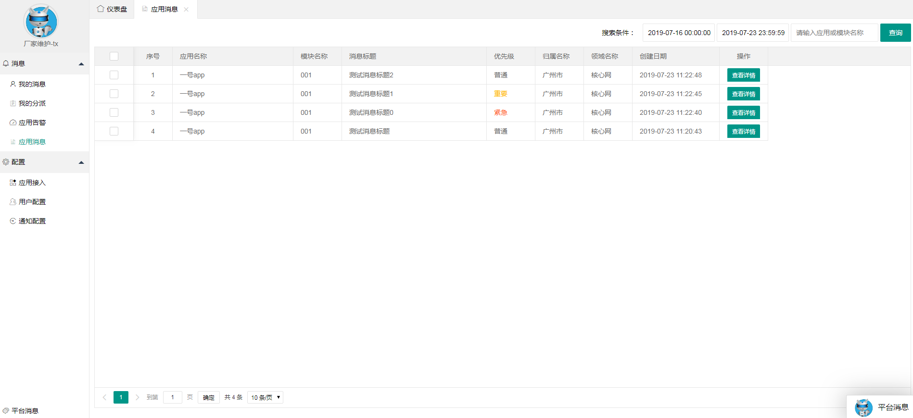
---
**应用消息列表：**
>- 默认显示当前一周内的应用消息，按创建日期倒序排列
>- 显示消息的来源，包括应用名称，模块名称，归属名称和领域名称
>- 显示消息的优先级
>- 显示消息的创建时间
>- 归属名称和领域名称可以为空，其他项不能为空

**消息操作：**
>- 消息操作只有详情操作
>- 点击详情，弹窗显示消息的详细信息

**查询：**
>- 根据搜索条件搜索应用消息
>- 可选择时间段搜索应用消息
>- 可输入应用或模块的名称搜索应用消息
>- 搜索后的列表按照创建日期倒序排列

**分页控件：**
>- 显示一共有多少条消息以及每页展示多少条消息
>- 显示一共有多少页消息以及当前所在的页
>- 可以点击页码进行翻页
>- 可以输入页码，点击确定进行翻页
>- 可以选择每页展示多少条消息

***

##2.4 配置
###2.4.1 应用接入
**功能描述**
>1. 显示当前已接入的所有应用及模块；
>2. 显示已接入应用的各项信息；
>3. 新建应用；
>4. 修改应用名称，应用模块配置和删除应用；
>5. 可根据搜索条件搜索应用。

主页面如下图所示：
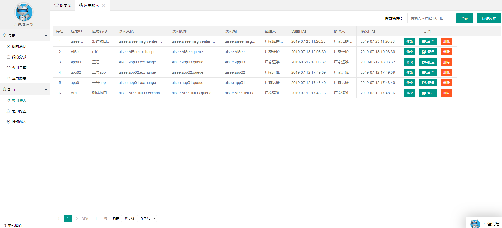
---
**应用接入列表：**
>- 显示当前已接入的所有应用，包括应用ID，应用名称，默认交换，默认队列，默认路由
>- 显示应用的创建人，创建日期，修改人，修改日期
>- 列表显示按照修改日期倒序排列

**新建应用：**
>- 点击新建应用，弹出新建应用弹窗
>- 输入应用ID和应用名称，应用新建成功
>- 默认交换，默认队列，默认路由将根据应用ID自动生成，无法修改

**应用操作：**
>- 应用操作栏可以进行修改，模块配置和删除操作
>- 点击修改，可以修改应用名称，应用ID、默认交换、默认队列、默认路由无法修改
>- 点击模块配置，可以配置应用的模块
>- 点击删除，可以删除应用(包括应用内的模块也会全部删除)

**模块配置：**
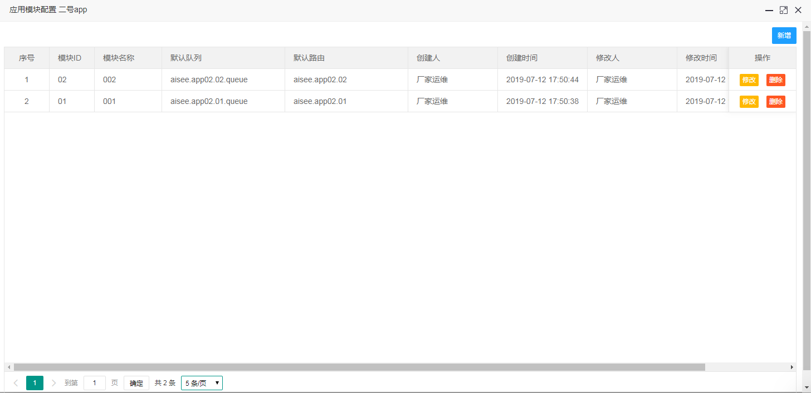
>**功能描述：**
>>- 显示当前应用已配置的模块，包括模块ID，模块名称，默认队列，默认路由
>>- 显示模块的创建人，创建时间，修改人，修改时间和备注信息
>>- 点击新增，输入模块ID、模块名称和备注，可以新增应用的模块
>>- 默认队列，默认路由将根据应用ID自动生成，无法修改
>>- 点击修改，可以修改模块名称和备注，模块ID、默认队列、默认路由无法修改
>>- 点击删除，可以删除模块

>**分页控件：**
>>- 显示一共有多少条消息以及每页展示多少条消息
>>- 显示一共有多少页消息以及当前所在的页
>>- 可以点击页码进行翻页
>>- 可以输入页码，点击确定进行翻页
>>- 可以选择每页展示多少条消息

**查询：**
>- 根据搜索条件搜索已接入的应用
>- 可输入应用名称或应用ID搜索应用
>- 搜索后的列表显示按照修改日期倒序排列

**分页控件：**
>- 显示一共有多少条消息以及每页展示多少条消息
>- 显示一共有多少页消息以及当前所在的页
>- 可以点击页码进行翻页
>- 可以输入页码，点击确定进行翻页
>- 可以选择每页展示多少条消息

***

###2.4.2 用户配置
- 模块配置了用户配置时，该模块产生的告警信息就会推送给该模块配置的用户，进入推送用户的我的消息页面  
- 模块未配置用户配置时，该模块产生的告警信息就会推送到应用告警公共页面  

**功能描述**
>1. 显示当前已配置的用户配置；
>2. 显示用户配置的各项信息；
>3. 新建配置；
>4. 编辑配置和删除配置；
>5. 可根据搜索条件搜索用户配置。

主页面如下图所示：
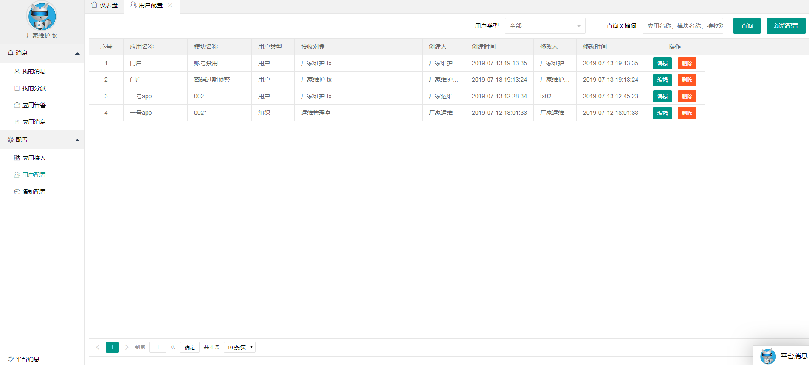
---
**用户配置列表：**
>- 显示当前已有的用户配置，包括应用名称，模块名称，用户类型和接收对象
>- 显示应用的创建人，创建时间，修改人，修改时间
>- 列表显示按照修改时间倒序排列

**新增配置：**
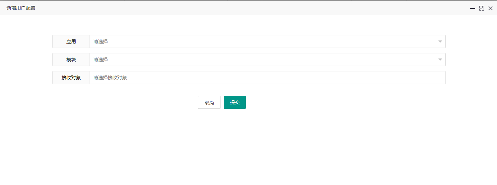
>- 新增配置时，模块必须存在(已配置的模块不能重复配置)
>- 点击新增配置，弹出新增配置弹窗
>- 选择应用、模块和接收对象
>- 点击提交，配置保存成功

>**接收对象：个人**
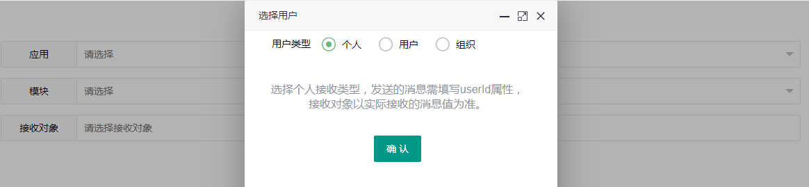
>>- 当接收对象为个人时，模块推送的告警消息必须包含有userid字段
>>- 当告警消息产生时，告警消息会推送到userid用户的我的消息栏

>**接收对象：用户**
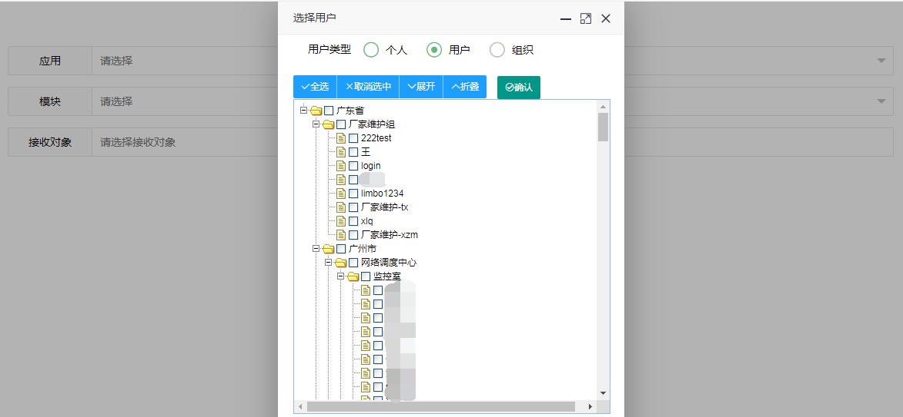
>>- 当接收对象为用户时，需要勾选要推送的用户
>>- 当告警消息产生时，告警消息会推送到所有勾选用户的我的消息栏

>**接收对象：组织**
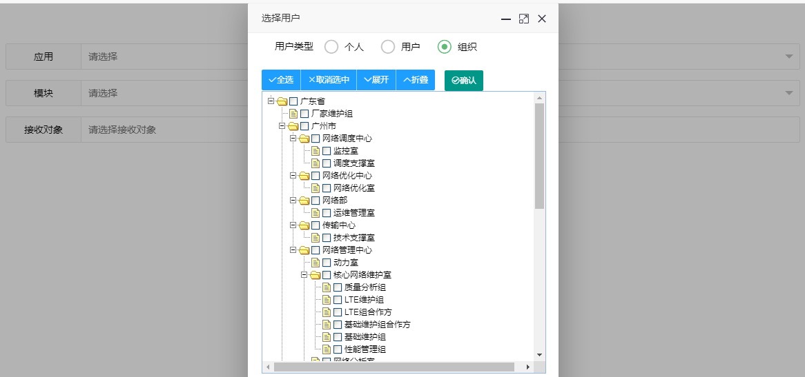
>>- 当接收对象为组织时，需要勾选要推送的组织
>>- 勾选组织时，不向下覆盖子组织，需要手动勾选
>>- 当告警消息产生时，告警消息会推送到所有组织内用户的我的消息栏

**应用操作：**
>- 应用操作栏可以进行编辑配置和删除配置
>- 点击编辑，可以修改用户类型和接收对象，应用名称和模块无法修改
>- 点击删除，可以删除应用模块的用户配置

**查询：**
>- 根据搜索条件搜索已有的用户配置
>- 可选择用户类型搜索用户配置
>- 可输入应用名称、模块名称、接收对象的关键词搜索用户配置
>- 搜索后的列表显示按照修改时间倒序排列

**分页控件：**
>- 显示一共有多少条消息以及每页展示多少条消息
>- 显示一共有多少页消息以及当前所在的页
>- 可以点击页码进行翻页
>- 可以输入页码，点击确定进行翻页
>- 可以选择每页展示多少条消息

***

###2.4.3 通知配置
- 模块配置了通知配置时，该模块产生的告警信息就会推送给该模块配置的用户，进入推送用户的我的消息页面，同时会根据通知配置的规则发送邮件、微信和短信  
- 模块未配置用户配置时，该模块不能配置通知配置  

**功能描述**
>1. 显示当前已配置的通知配置；
>2. 显示通知配置的各项信息；
>3. 新建配置和刷新配置；
>4. 编辑配置和删除配置；
>5. 可根据搜索条件搜索通知配置。

主页面如下图所示：
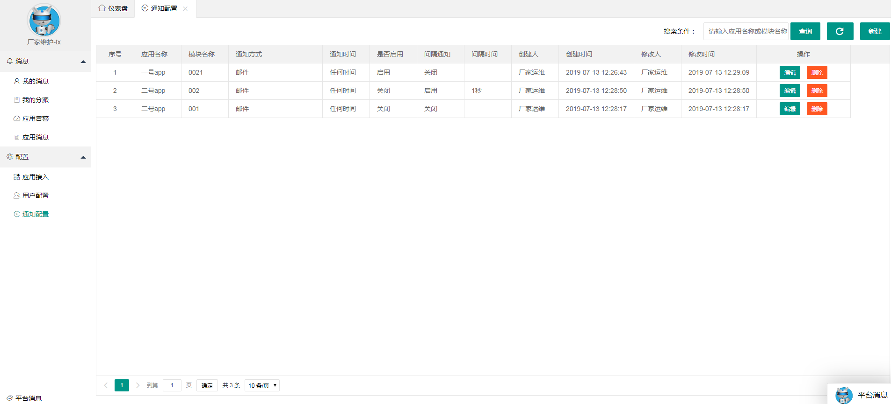
---
**通知配置列表：**
>- 显示当前已有的通知配置，包括应用名称，模块名称，通知方式和通知时间
>- 显示通知配置是否启用，间隔通知是否启用以及间隔时间
>- 显示通知配置的创建人，创建时间，修改人，修改时间
>- 列表显示按照修改时间倒序排列

**新增配置：**
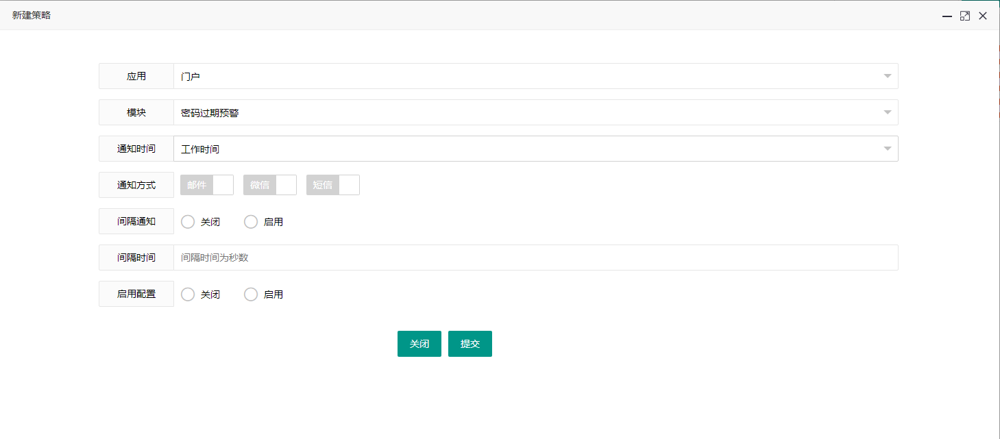
>- 新增配置时，模块必须存在，并且已配置用户配置(已配置的模块不能重复配置)
>- 点击新增配置，弹出新增配置弹窗
>- 选择应用、模块、通知时间
>- 勾选通知方式，可选择一种或多种
>- 选择间隔通知是否启用，启用可以设置发送通知的间隔时间，关闭不用设置间隔时间
>- 选择是否启用配置，点击提交，配置保存成功

**刷新配置：**
>- 点击刷新按钮，通知配置列表刷新

**应用操作：**
>- 应用操作栏可以进行编辑配置和删除配置
>- 点击编辑，可以修改通知时间、通知方式、间隔通知、间隔时间和是否启用
>- 点击编辑，应用名称和模块无法修改
>- 点击删除，可以删除应用模块的通知配置

**查询：**
>- 根据搜索条件搜索已有的通知配置
>- 可输入应用名称、模块名称的关键词搜索通知配置
>- 搜索后的列表显示按照修改时间倒序排列

**分页控件：**
>- 显示一共有多少条消息以及每页展示多少条消息
>- 显示一共有多少页消息以及当前所在的页
>- 可以点击页码进行翻页
>- 可以输入页码，点击确定进行翻页
>- 可以选择每页展示多少条消息

***

#3. 案例介绍
##3.1 内部应用接入消息中心
###3.1.1 创建密码过期提醒任务
- 配置定时任务每日巡查 超过强制修改期限的用户，推送消息中心
- 配置定时任务每日巡查 密码过期预警到达的用户，推送消息中心

**消息中心配置**
>1. 配置-应用接入页面，新建应用，应用ID必须为：AiSee，应用名称随意：
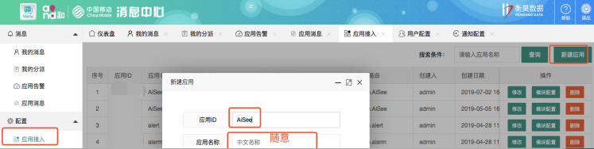

>2. AiSee应用上点击模块配置--新增模块：密码过期预警，模块ID必须为：pwdOverdueWarning
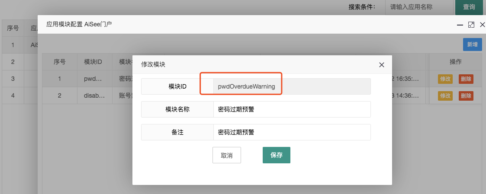

>3. AiSee应用上点击模块配置--新增模块：账号禁用，模块ID必须为：disableAccount
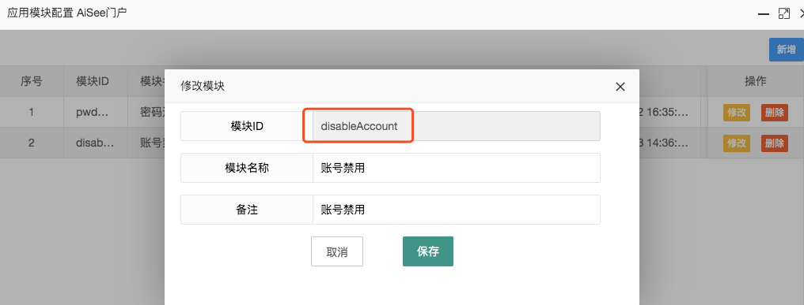

>4. 配置-用户配置页面，为密码过期预警模块新增配置，接收对象为个人
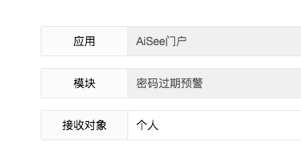

>5. 配置-用户配置页面，为账号禁用模块新增配置，接收对象为用户- 管理员
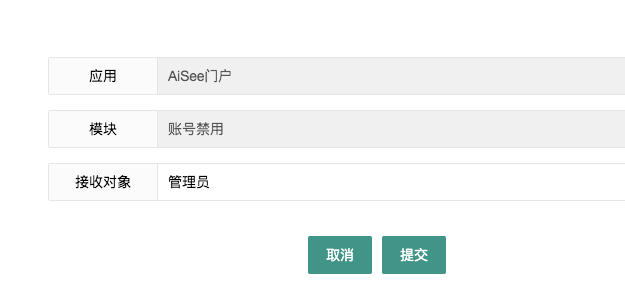

>6. 配置-通知配置页面，为密码过期预警模块新增配置，通知方式为邮件
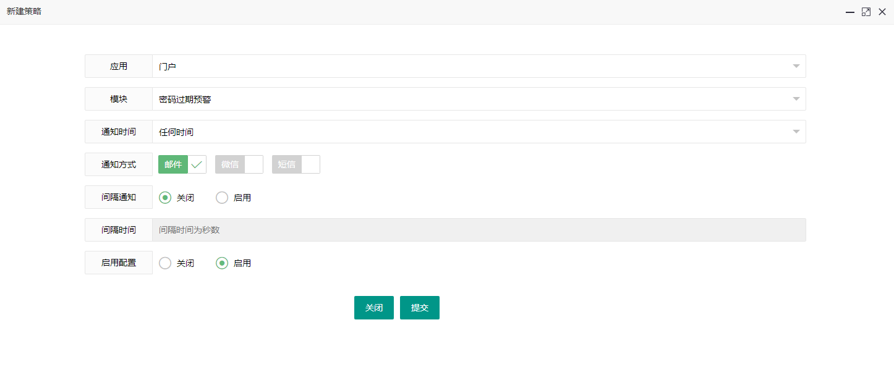

>7. 配置-通知配置页面，为账号禁用模块新增配置，通知方式为邮件
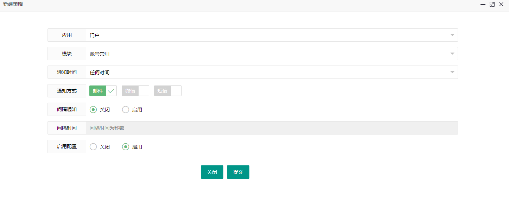

**VM任务模版配置**
>1. 在VisualModeler页面，任务管家的任务模版管理，为新增的接口配置定时任务：
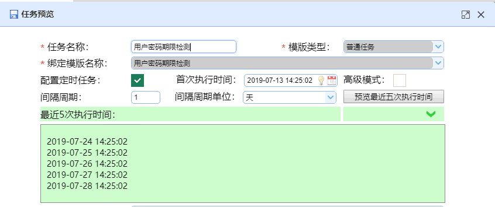

**发送消息和邮件**
>1. 用户HH01账号修改密码期限内未修改密码已被禁用
>2. 任务管家定时任务调用接口，推送消息到消息中心
>3. 消息中心根据用户配置，将消息推送到管理员用户的我的消息界面
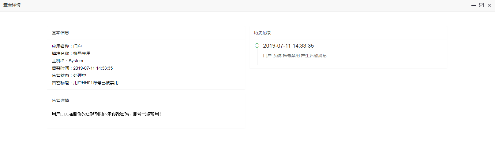
>4. 消息中心根据通知配置，将消息推送到管理员用户的邮件地址
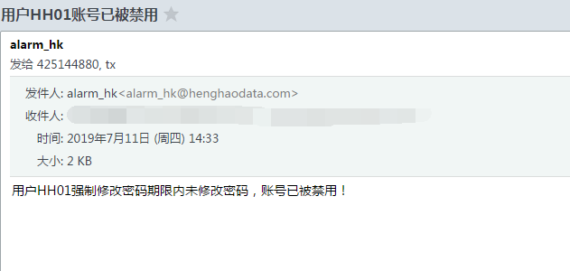

<!-- <meta http-equiv="refresh" content="20"> -->